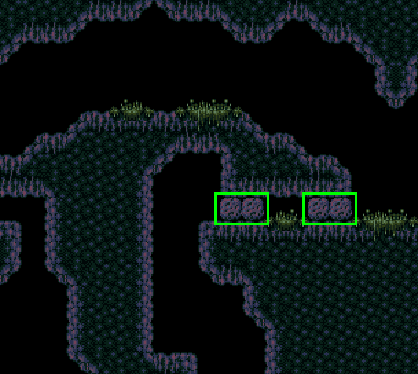
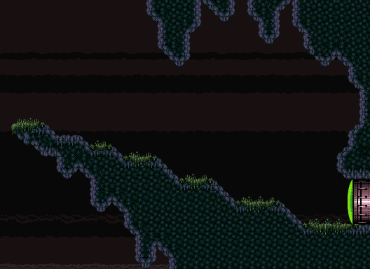

# SuperMetroidRandomizer

### What's changed?
- Major items are shuffled, i.e. items there are only one of in the game (except Morph Ball)
- Tourian is much shorter now, skipping straight to Mother Brain
- The bomb blocks outside of Bomb Torizo are now shot blocks instead  

- The power bomb above landing site is blocked by a super missile door now (originally a power bomb door)  

- These drop blocks, which I'm sure everyone is familiar with, no longer respawn (image coming soon)

### Additional Info
- Morph Ball will always be in its vanilla location
- Bomb Torizo will only have either Bombs, Speed Booster (unless disabled), or Screw Attack
- Maridia will never have Grapple Beam or Gravity Suit
	- Spring Ball Room will never have Space Jump
- Lower Norfair will never have Gravity Suit or Space Jump

### Important Info
- Incompleteable seeds are probably possible
- There are probably a few softlocks that can happen